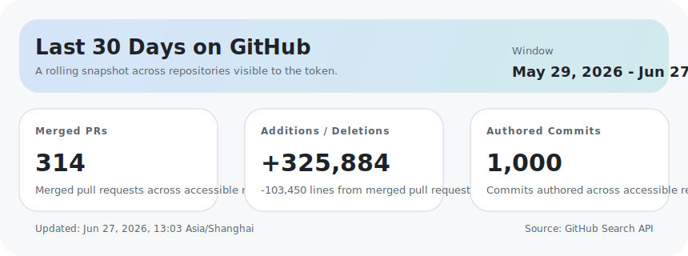

# Hi, I'm jomeswang

I build web apps, automation workflows, and AI-driven product experiments. Lately I have been focused on dashboards, developer tooling, and practical full-stack products.

- Next.js, React 19, and modern TypeScript stacks
- Agent dashboards, internal tools, and workflow automation
- Small products that turn ideas into something people can actually use

## 30-Day GitHub Snapshot

| Metric | Value |
| --- | --- |
| Merged PRs | **80** |
| Additions / Deletions | **+339,878 / -17,656** |
| Authored commits | **498** |
| Window | **Mar 31, 2026 - Apr 29, 2026** |
| Last updated | **Apr 29, 2026, 12:38 Asia/Shanghai** |

These stats cover **repositories visible to the token**. When the PROFILE_STATS_TOKEN secret is configured in this repo, that includes private and organization repositories the token can read.

## Featured Projects

| Project | Summary |
| --- | --- |
| [openclaw-TenacitOS](https://github.com/jomeswang/openclaw-TenacitOS) | A real-time dashboard and control center for OpenClaw AI agent instances. |
| [iodraw-files](https://github.com/jomeswang/iodraw-files) | Diagram, whiteboard, and code-drawing assets for visualization workflows. |
| [pick-packet-dapp](https://github.com/jomeswang/pick-packet-dapp) | A TypeScript DApp experiment focused on interactive blockchain product ideas. |
| [pythonWebCrawler](https://github.com/jomeswang/pythonWebCrawler) | Python crawler examples and notes aimed at practical learning and experimentation. |

## How This README Works

- [scripts/generate-profile.mjs](./scripts/generate-profile.mjs) pulls PR and commit data from the GitHub Search API.
- [assets/activity-card.svg](./assets/activity-card.svg) is regenerated together with this README so the card always stays in sync.
- [.github/workflows/update-profile.yml](./.github/workflows/update-profile.yml) refreshes the snapshot every day and on manual runs.
- GitHub's contribution graph can still look larger because it also includes issues, reviews, and restricted private contributions.
